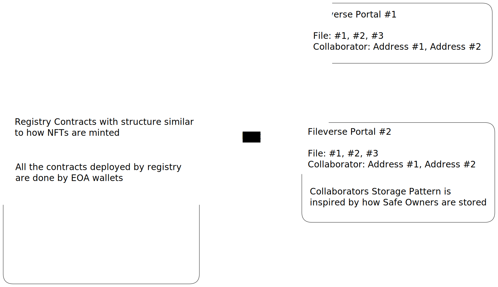

# Fileverse Contracts
This repository contains the contracts for Fileverse Portal, which allow for onchain collaboration, file management, and decentralized access control. It includes:

- Fileverse Portal Registry Contract 
- Fileverse Portal Contract
- Fileverse Comment Contract

Usage
-----
### Install requirements with npm:

```bash
npm install
```

### Run all tests:

```bash
npm test
npm coverage
```

### Error Codes

```bash
docs/ErrorCode.md
```

### High Level Spec



[Technical Spec](./docs/TECHSPEC.md)
