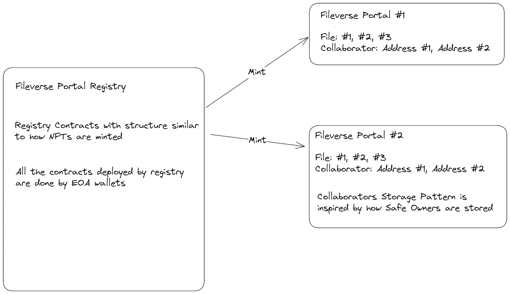

# Fileverse Contracts

Usage
-----
### Install requirements with npm:

```bash
npm install
```

### Run all tests:

```bash
npm test
npm coverage
```

### Error Codes

```bash
docs/ErrorCode.md
```

### High Level Spec


